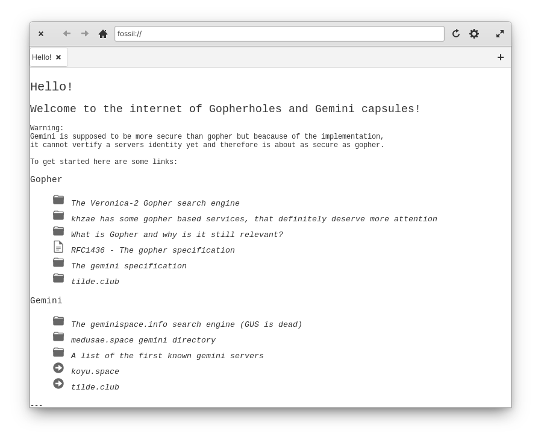

# Fossil

A simple GTK Gopher/Gemini client written in Vala

<a class="btn btn-success btn-lg" href="https://github.com/koyuspace/fossil/releases/download/v1.0/com.github.koyuspace.fossil" style="margin: 10px 0;margin-right:5px;"><i class="fa fa-download" aria-hidden="true"></i> Download</a> <a class="btn btn-success btn-lg" href="https://github.com/koyuspace/fossil" target="_blank" style="margin: 10px 0;margin-right:5px;"><i class="fa fa-github" aria-hidden="true"></i> GitHub</a>

### Supported download protocols

- Gopher
- Gemini
- Finger

### Supported upload protocols

- [gopher+write](https://alexschroeder.ch/wiki/2017-12-30_Gopher_Wiki)
- [gemini+write](https://alexschroeder.ch/wiki/2020-06-04_Gemini_Upload)
- [gemini+upload](https://alexschroeder.ch/wiki/Baschdels_spin_on_Gemini_uploading)

### Noteworthy features

- Tabs
- Bookmarks
- In-application image display
- View page source option
- Support for `file://` URIs
- Per tab history
- Ability to save everything to disk
- Cache
- Works on Linux-based smartphones
- Tries to be as themeable as possible using GTK themes and icon packs
- Favicons